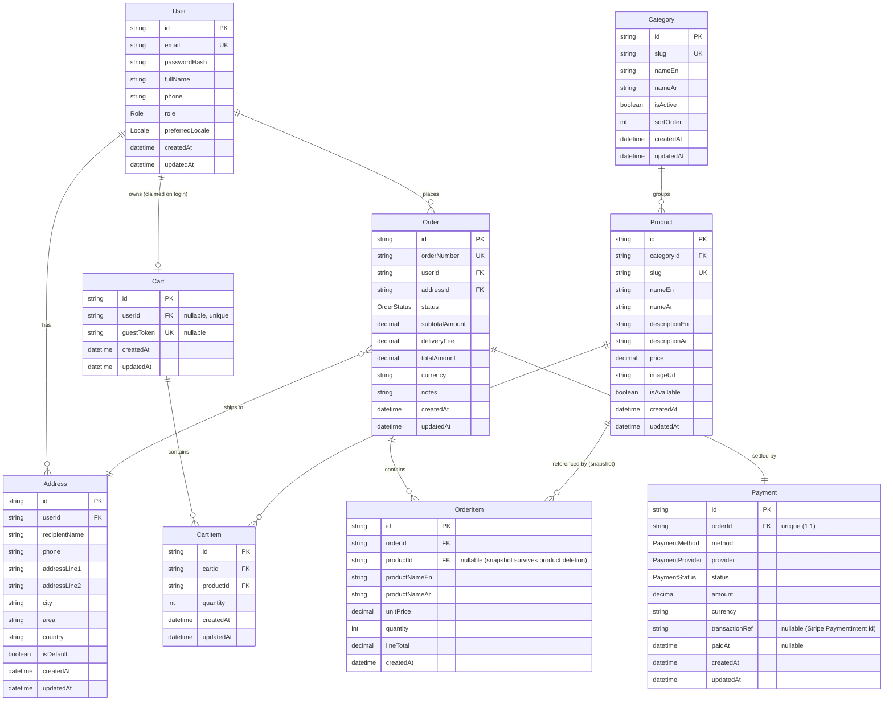

# electro-PI — Phase 1: Architecture & Database Design

**Status:** Domain model design only · Prisma schema is the only code permitted · No NestJS/controllers/services/DTOs/endpoints/business logic generated · Phase 0 frozen & approved

---

## 1. Entity-Relationship Diagram (ERD)



---

## 2. Relationships & Cardinalities

| Relationship | Cardinality | Notes |
|---|---|---|
| **User → Address** | 1 : 0..N | A user owns zero or more saved addresses. Deleting a user cascades their addresses. |
| **User → Cart** | 1 : 0..1 | A user has at most one cart. A cart may also exist **without** a user (guest) until claimed on login. |
| **User → Order** | 1 : 0..N | A user places zero or more orders. Orders are retained even conceptually long-lived; user deletion is restricted while orders exist (see rationale). |
| **Category → Product** | 1 : 0..N | Each product belongs to exactly one category. A category groups zero or more products. |
| **Cart → CartItem** | 1 : 0..N | A cart contains zero or more line items. Deleting a cart cascades its items. |
| **Product → CartItem** | 1 : 0..N | A cart item references one product. Deleting a product cascades the affected cart items (live cart only). |
| **Order → OrderItem** | 1 : 1..N | An order contains one or more line items. Deleting an order cascades its items. |
| **Product → OrderItem** | 1 : 0..N | An order item references one product **for traceability**, but carries a **snapshot** of name/price so history survives product deletion (FK set null). |
| **Order → Address** | N : 1 | An order ships to exactly one address. Address deletion is **restricted** while referenced by an order. |
| **Order → Payment** | 1 : 1 | Each order has exactly one payment record, created at checkout. The two lifecycles (`OrderStatus`, `PaymentStatus`) evolve independently. |

---

## 3. Enums

| Enum | Values | Purpose |
|---|---|---|
| **Role** | `CUSTOMER`, `ADMIN` | The only two persisted roles. Guests are not persisted. |
| **Locale** | `EN`, `AR` | Supported languages; stored as the user's preferred locale. |
| **OrderStatus** | `PENDING`, `CONFIRMED`, `PREPARING`, `OUT_FOR_DELIVERY`, `DELIVERED`, `CANCELLED` | Fulfilment lifecycle (from frozen Phase 0). |
| **PaymentStatus** | `UNPAID`, `PENDING`, `PAID`, `FAILED`, `REFUNDED` | Settlement lifecycle, independent of fulfilment. |
| **PaymentMethod** | `ONLINE`, `CASH_ON_DELIVERY` | *How* the customer chooses to pay. |
| **PaymentProvider** | `STRIPE`, `CASH_ON_DELIVERY` | *Which* concrete provider settles the payment. Persisted on `Payment`. |

> **`PaymentMethod` and `PaymentProvider` are separate concepts.** Method captures the customer's choice at checkout; provider captures the settlement backend that actually processed it. They are 1:1 today (`ONLINE → STRIPE`, `CASH_ON_DELIVERY → CASH_ON_DELIVERY`) but kept distinct so a future online provider can be added without overloading `method`. `transactionRef` stores the gateway reference when one exists.

### Lifecycle decoupling (your note #2)

| Method | Typical PaymentStatus path | Independent of OrderStatus |
|---|---|---|
| `CASH_ON_DELIVERY` | `UNPAID` → `PAID` (on delivery) / `FAILED` (refused) | Order can reach `OUT_FOR_DELIVERY` while still `UNPAID`. |
| `ONLINE` (Stripe) | `PENDING` → `PAID` / `FAILED`, later `REFUNDED` | Order stays `PENDING` until payment is `PAID`, then advances. |

---

## 4. Prisma Schema

```prisma
// Phase 1 — domain model only. No business logic, no app wiring.

generator client {
  provider = "prisma-client-js"
}

datasource db {
  provider = "postgresql"
  url      = env("DATABASE_URL")
}

// ---------- Enums ----------

enum Role {
  CUSTOMER
  ADMIN
}

enum Locale {
  EN
  AR
}

enum OrderStatus {
  PENDING
  CONFIRMED
  PREPARING
  OUT_FOR_DELIVERY
  DELIVERED
  CANCELLED
}

enum PaymentStatus {
  UNPAID
  PENDING
  PAID
  FAILED
  REFUNDED
}

enum PaymentMethod {
  ONLINE
  CASH_ON_DELIVERY
}

enum PaymentProvider {
  STRIPE
  CASH_ON_DELIVERY
}

// ---------- Identity ----------

model User {
  id              String    @id @default(cuid())
  email           String    @unique
  passwordHash    String
  fullName        String
  phone           String?
  role            Role      @default(CUSTOMER)
  preferredLocale Locale    @default(EN)

  addresses       Address[]
  cart            Cart?
  orders          Order[]

  createdAt       DateTime  @default(now())
  updatedAt       DateTime  @updatedAt

  @@index([role])
}

model Address {
  id            String   @id @default(cuid())
  userId        String
  user          User     @relation(fields: [userId], references: [id], onDelete: Cascade)

  recipientName String
  phone         String
  addressLine1  String
  addressLine2  String?
  city          String
  area          String?
  country       String
  isDefault     Boolean  @default(false)

  orders        Order[]

  createdAt     DateTime @default(now())
  updatedAt     DateTime @updatedAt

  @@index([userId])
}

// ---------- Catalog ----------

model Category {
  id        String    @id @default(cuid())
  slug      String    @unique
  nameEn    String
  nameAr    String
  isActive  Boolean   @default(true)
  sortOrder Int       @default(0)

  products  Product[]

  createdAt DateTime  @default(now())
  updatedAt DateTime  @updatedAt
}

model Product {
  id            String      @id @default(cuid())
  categoryId    String
  category      Category    @relation(fields: [categoryId], references: [id], onDelete: Restrict)

  slug          String      @unique
  nameEn        String
  nameAr        String
  descriptionEn String
  descriptionAr String
  price         Decimal     @db.Decimal(10, 2)
  imageUrl      String?
  isAvailable   Boolean     @default(true)

  cartItems     CartItem[]
  orderItems    OrderItem[]

  createdAt     DateTime    @default(now())
  updatedAt     DateTime    @updatedAt

  @@index([categoryId])
  @@index([isAvailable])
}

// ---------- Cart ----------

model Cart {
  id         String     @id @default(cuid())
  userId     String?    @unique
  user       User?      @relation(fields: [userId], references: [id], onDelete: Cascade)
  guestToken String?    @unique

  items      CartItem[]

  createdAt  DateTime   @default(now())
  updatedAt  DateTime   @updatedAt
}

model CartItem {
  id        String   @id @default(cuid())
  cartId    String
  cart      Cart     @relation(fields: [cartId], references: [id], onDelete: Cascade)
  productId String
  product   Product  @relation(fields: [productId], references: [id], onDelete: Cascade)
  quantity  Int      @default(1)

  createdAt DateTime @default(now())
  updatedAt DateTime @updatedAt

  @@unique([cartId, productId])
  @@index([cartId])
}

// ---------- Orders ----------

model Order {
  id             String      @id @default(cuid())
  orderNumber    String      @unique
  userId         String
  user           User        @relation(fields: [userId], references: [id], onDelete: Restrict)
  addressId      String
  address        Address     @relation(fields: [addressId], references: [id], onDelete: Restrict)

  status         OrderStatus @default(PENDING)
  subtotalAmount Decimal     @db.Decimal(10, 2)
  deliveryFee    Decimal     @default(0) @db.Decimal(10, 2)
  totalAmount    Decimal     @db.Decimal(10, 2)
  currency       String      @default("USD")
  notes          String?

  items          OrderItem[]
  payment        Payment?

  createdAt      DateTime    @default(now())
  updatedAt      DateTime    @updatedAt

  @@index([userId])
  @@index([status])
}

model OrderItem {
  id            String   @id @default(cuid())
  orderId       String
  order         Order    @relation(fields: [orderId], references: [id], onDelete: Cascade)
  productId     String?
  product       Product? @relation(fields: [productId], references: [id], onDelete: SetNull)

  // Snapshot — preserves history if the product is later edited or deleted.
  productNameEn String
  productNameAr String
  unitPrice     Decimal  @db.Decimal(10, 2)
  quantity      Int
  lineTotal     Decimal  @db.Decimal(10, 2)

  createdAt     DateTime @default(now())

  @@index([orderId])
}

// ---------- Payment ----------

model Payment {
  id             String        @id @default(cuid())
  orderId        String        @unique
  order          Order         @relation(fields: [orderId], references: [id], onDelete: Cascade)

  method         PaymentMethod
  provider       PaymentProvider
  status         PaymentStatus @default(UNPAID)
  amount         Decimal       @db.Decimal(10, 2)
  currency       String        @default("USD")
  transactionRef String?       // Stripe PaymentIntent id; null for COD
  paidAt         DateTime?

  createdAt      DateTime      @default(now())
  updatedAt      DateTime      @updatedAt

  @@index([status])
}
```

---

## 5. Important Design Decisions

1. **Address as a first-class entity (your note #1).** Orders reference `Address` by FK and never store a flattened string. Address deletion is `Restrict`ed while referenced by an order, so historical orders always resolve to a valid address. Saved addresses are reusable across orders and support an `isDefault` flag for checkout UX.

2. **Payment separated from Order with an independent lifecycle (your note #2).** `OrderStatus` (fulfilment) and `PaymentStatus` (settlement) live on different tables and never share a column. This cleanly models the divergence between Stripe (`PENDING → PAID`) and COD (`UNPAID → PAID` on delivery). The 1:1 link keeps each order to exactly one payment record for this prototype.

3. **Order line items are snapshots, not live joins.** `OrderItem` copies `productNameEn/Ar`, `unitPrice`, and `lineTotal` at purchase time. The `productId` FK is nullable with `onDelete: SetNull`, so editing or deleting a product never rewrites historical orders. Carts, by contrast, reference live products (`onDelete: Cascade`) because they represent current intent.

4. **Bilingual content via paired columns (`*En` / `*Ar`).** With exactly two fixed languages, paired columns on `Category`/`Product` are simpler and faster to query than a separate translation table, while fully satisfying AR/EN content. A translation table would be the upgrade path if languages became dynamic — explicitly deferred to avoid over-engineering.

5. **Guest cart that persists after login.** `Cart.userId` is nullable + unique and `guestToken` is a unique anonymous handle. A guest's cart is persisted under `guestToken`; on login it is claimed/merged into the user's cart. This satisfies the frozen Phase 0 decision without persisting guest *users*.

6. **Money as `Decimal(10,2)`.** All monetary fields use fixed-precision `Decimal` to avoid floating-point rounding. `currency` is stored on `Order` and `Payment` (default `USD`) because Stripe requires an explicit currency; the default keeps single-currency setups simple.

7. **Order totals are stored, cart totals are computed.** `Order.subtotalAmount/deliveryFee/totalAmount` are persisted snapshots (immutable financial record). Cart totals are derived on read from live prices — no stored aggregate to drift out of sync.

8. **Referential-integrity policy is explicit per relation.** `Cascade` for owned/dependent rows (addresses, cart items, order items, payment), `Restrict` for references that must not orphan financial/historical records (order→user, order→address, product→category), `SetNull` for the order-item product snapshot.

9. **`orderNumber` as a human-facing unique key.** Separate from the internal `cuid()` id, for customer-facing references and admin search, indexed via `@unique`.

10. **Indexes target known read paths.** `Product.categoryId` / `isAvailable` (menu browsing), `Order.userId` / `status` (order history & admin monitoring), `Payment.status` (reconciliation) — scalable without speculative indexing.

---

## 6. Seed Strategy

Idempotent seeding (all `upsert` on unique keys) so it can re-run safely in any environment.

| Step | What | How | Rationale |
|---|---|---|---|
| 1 | **Admin user(s)** | `upsert` by `email`; credentials from environment variables; `role = ADMIN`. | Phase 0 decision: admins are seeded manually, never self-registered. No password is hard-coded in the repo. |
| 2 | **Categories** | `upsert` a small fixed set (e.g. Appetizers / Mains / Desserts / Drinks) with `nameEn` + `nameAr`. | Provides a navigable menu skeleton; bilingual from the start. |
| 3 | **Products** | `upsert` a handful per category with bilingual name/description, `price`, `isAvailable`, placeholder `imageUrl`. | Enough data to exercise browse → cart → checkout end to end. |

**Not seeded:** customers (they register), carts, orders, payments, addresses — these are created at runtime through real flows, keeping the seed deterministic and side-effect free.

**Conventions:** stable `where` keys for every `upsert` (email for users, a natural key or fixed slug for categories/products); no reliance on auto-generated ids; safe to run on every deploy.

---

## 7. Scalability vs. Over-Engineering — boundary held

**Built in (justified):** snapshots for financial history, explicit FK delete policies, targeted indexes, decoupled payment lifecycle, idempotent seeds.

**Deliberately excluded (no requirement):** translation tables, coupons/discounts, wishlist, reviews/ratings, loyalty points, delivery drivers, multi-vendor, audit/event tables, soft-delete framework. None are present.

---

## Phase 1 Boundaries (honored)

- ✅ ERD, entities, relationships/cardinalities, enums, Prisma schema, design rationale, seed strategy.
- ❌ No NestJS files, controllers, services, DTOs, folder structures, package installation, API endpoints, business logic, frontend code, or auth implementation.

**Awaiting your review before Phase 2.** Do not proceed to Phase 2 until approved.
